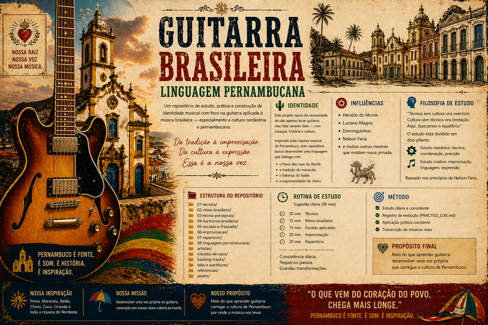

# 🎸 Guitarra Brasileira | Linguagem Pernambucana

> Um repositório de estudo, prática e construção de identidade musical  
> com foco na guitarra aplicada à música brasileira — especialmente a cultura nordestina e pernambucana.

---



---

## 🌵 Identidade

Este projeto nasce da necessidade de não apenas tocar guitarra, mas **falar através dela** — com sotaque, história e cultura.

Inspirado pela riqueza musical de Pernambuco, este repositório busca desenvolver uma linguagem que dialoga com:

- Frevo
- Maracatu (baque solto)
- Baião
- Choro
- MPB

---

## 🎭 Influências

- Heraldo do Monte  
- Luciano Magno  
- Dominguinhos  
- Nelson Faria  

---

## 🪘 Filosofia de Estudo

> Técnica sem cultura vira exercício.  
> Cultura sem técnica vira limitação.  
> Aqui, buscamos o equilíbrio.

O estudo está dividido em dois pilares:

- 🔧 Estudo mecânico → técnica, coordenação, precisão  
- 🎶 Estudo criativo → improvisação, linguagem, expressão  

---

## 🗺️ Estrutura do Repositório

```
01-tecnica/
02-ritmo-brasileiro/
03-teoria-percepcao/
04-harmonia-brasileira/
05-escalas-e-fraseado/
06-improvisacao/
07-repertorio/
08-linguagem-pernambucana/
artistas/
estudos-de-caso/
```

---

## 🎯 Objetivo

Desenvolver:

- domínio técnico do instrumento  
- compreensão harmônica aplicada  
- improvisação consciente  
- identidade musical brasileira  

---

## 📓 Rotina de Estudo

- 20 min Técnica  
- 15 min Ritmo brasileiro  
- 15 min Escalas aplicadas  
- 20 min Improvisação  
- 20 min Repertório  

Total: 90 minutos diários  

---

## 🧠 Método

- Estudo diário e consistente  
- Registro de evolução (`PRACTICE_LOG.md`)  
- Aplicação prática constante  
- Transcrição de músicos reais  

---

## 🎨 Identidade Visual

Este projeto valoriza a estética cultural pernambucana:

- Arquitetura colonial (Olinda, Recife)
- Cores do frevo
- Elementos do maracatu rural
- Texturas inspiradas em xilogravura nordestina

---

## 🔥 Propósito Final

Mais do que aprender guitarra:

> desenvolver uma voz própria que carregue a cultura de Pernambuco.

---

## 🚀 Em construção

Este repositório está em constante evolução — assim como o músico que o mantém.
